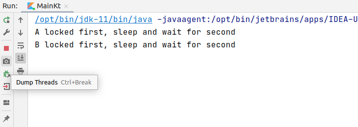
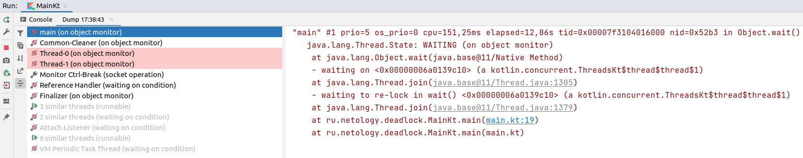

# Домашнее задание к занятию «4. Примитивы синхронизации и специализированные структуры данных»

Выполненное задание прикрепите ссылкой на ваши GitHub-проекты в личном кабинете студента на сайте [netology.ru](https://netology.ru).

## Задача №1. Deadlock

### Легенда

У вас есть кусок кода, который почему-то не работает:

```kotlin
package ru.netology.deadlock

import kotlin.concurrent.thread

fun main() {
    val resourceA = Any()
    val resourceB = Any()

    val consumerA = Consumer("A")
    val consumerB = Consumer("B")

    val t1 = thread {
        consumerA.lockFirstAndTrySecond(resourceA, resourceB)
    }
    val t2 = thread {
        consumerB.lockFirstAndTrySecond(resourceB, resourceA)
    }

    t1.join()
    t2.join()

    println("main successfully finished")
}

class Consumer(private val name: String) {
    fun lockFirstAndTrySecond(first: Any, second: Any) {
        synchronized(first) {
            println("$name locked first, sleep and wait for second")
            Thread.sleep(1000)
            lockSecond(second)
        }
    }

    fun lockSecond(second: Any) {
        synchronized(second) {
            println("$name locked second")
        }
    }
}
```

### Задача

Запустите этот код в IntelliJ IDEA и попробуйте разобраться, почему работа функции `main` не завершается.

В анализе вам поможет функциональность IDEA (иконка фотоаппарата или `Ctrl + Break`):



Вы увидите снимок состояния потоков:



Проанализируйте код и состояние `Thread-0` и `Thread-1`.

### Результаты

В качестве результата пришлите текст ответа на вопрос «*По какой причине не завершается работа функции `main`?»* в личном кабинете студента на сайте [netology.ru](https://netology.ru).
