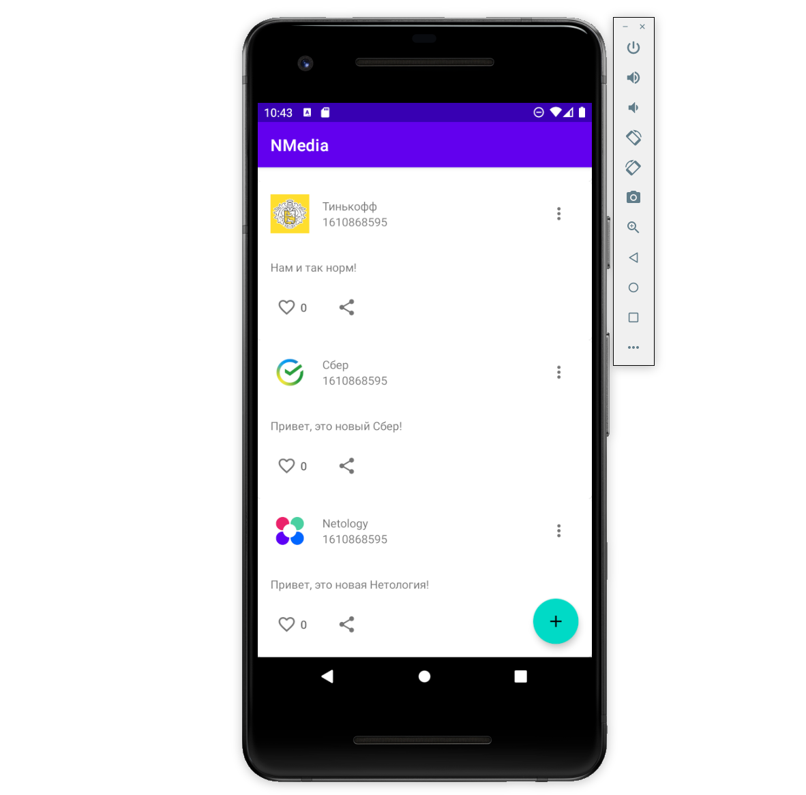
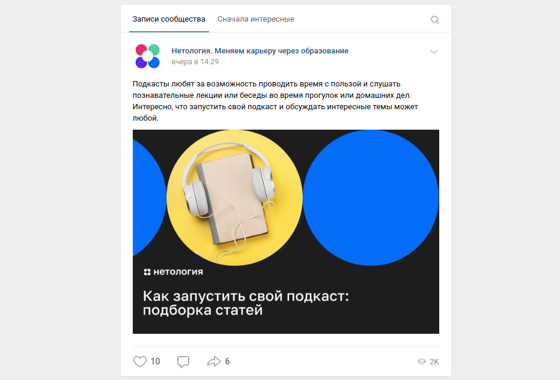

# Домашнее задание к занятию «2.4 Многопоточность в Android»

В качестве результата пришлите ссылки на ваш GitHub-проект в личном кабинете студента на сайте [netology.ru](https://netology.ru).

**Важно**: ознакомьтесь со ссылками, представленными на главной странице [репозитория с домашними заданиями](../README.md).

**Важно**: если у вас что-то не получилось, то оформляйте Issue [по установленным правилам](../report-requirements.md).

## Как сдавать задачи

1. Откройте ваш проект с предыдущего ДЗ (можете брать код с лекции)
1. Сделайте необходимые коммиты
1. Сделайте пуш (удостоверьтесь, что ваш код появился на GitHub)
1. Ссылку на ваш проект отправьте в личном кабинете на сайте [netology.ru](https://netology.ru)
1. Задачи, отмеченные, как необязательные, можно не сдавать, это не повлияет на получение зачета (в этом ДЗ все задачи являются обязательными)

## Задача Glide

### Легенда

Возьмите [проект сервера с лекции](https://github.com/netology-code/andin-code/tree/master/06_android) и с его использованием реализуйте отображение аватарок в вашем приложении.

В качестве библиотеки для загрузки изображений используйте [Glide](https://bumptech.github.io/glide/).

Опубликуйте изменения в виде Pull Request'а в вашем проекте на GitHub.

В качестве результата пришлите ссылку на PR GitHub-проект в личном кабинете студента на сайте [netology.ru](https://netology.ru).

## Задача Rounded

### Легенда

Подгруженные вами с сервера аватарки будут выглядеть как-то вот так (естественно, у вас должно быть красивее):



Заказчик хочет, чтобы аватарки были круглые. Поищите среди [методов трансформации](https://bumptech.github.io/glide/doc/transformations.html) тот, который подойдёт для этой задачи.

Опубликуйте изменения в виде Pull Request'а в вашем проекте на GitHub.

В качестве результата пришлите ссылку на PR GitHub-проект в личном кабинете студента на сайте [netology.ru](https://netology.ru).

## Задача Attachments*

**Важно**: это необязательная задача. Её (не)выполнение не влияет на получение зачёта по ДЗ.

### Легенда

На сервере реализовали для некоторых постов `вложения` (на самом деле вложение пока может быть только одно и только одного типа - `IMAGE`).

Вот как это выглядит (при запросе всех постов):
```json
[
  {
    "id": 5,
    "author": "Сбер",
    "authorAvatar": "sber.jpg",
    "content": "Появился новый способ мошенничества 😡 Злоумышленники звонят от имени банка и говорят, что для клиента выпущена новая, особо защищённая карта, которую можно добавить в приложение Кошелёк на смартфоне. Под диктовку мошенника человек привязывает к Кошельку его карту, причём указывает своё имя. Если карту пополнить, деньги уйдут мошеннику.\n\nДело в том, что в Кошелёк можно добавить любую, даже чужую карту, а имя поставить какое угодно. Но чужая банковская карта не будет отображаться, например, в СберБанк Онлайн.",
    "published": 1610869589,
    "likedByMe": false,
    "likes": 0,
    "attachment": {
      "url": "sbercard.jpg",
      "description": "Предлагают новую карту? Проверьте, не мошенничество ли это!",
      "type": "IMAGE"
    }
  },
  {
    "id": 4,
    "author": "Netology",
    "authorAvatar": "netology.jpg",
    "content": "Подкасты любят за возможность проводить время с пользой и слушать познавательные лекции или беседы во время прогулок или домашних дел. Интересно, что запустить свой подкаст и обсуждать интересные темы может любой.",
    "published": 1610869589,
    "likedByMe": false,
    "likes": 0,
    "attachment": {
      "url": "podcast.jpg",
      "description": "Как запустить свой подкаст: подборка статей",
      "type": "IMAGE"
    }
  },
  {
    "id": 3,
    "author": "Тинькофф",
    "authorAvatar": "tcs.jpg",
    "content": "Нам и так норм!",
    "published": 1610869589,
    "likedByMe": false,
    "likes": 0,
    "attachment": null
  },
  {
    "id": 2,
    "author": "Сбер",
    "authorAvatar": "sber.jpg",
    "content": "Привет, это новый Сбер!",
    "published": 1610869589,
    "likedByMe": false,
    "likes": 0,
    "attachment": null
  },
  {
    "id": 1,
    "author": "Netology",
    "authorAvatar": "netology.jpg",
    "content": "Привет, это новая Нетология!",
    "published": 1610869589,
    "likedByMe": false,
    "likes": 0,
    "attachment": null
  }
]
```

Реализуйте для тех постов, у которых есть `attachment` отображение соответствующей картинки в посте:



Опубликуйте изменения в виде Pull Request'а в вашем проекте на GitHub.

В качестве результата пришлите ссылку на PR GitHub-проект в личном кабинете студента на сайте [netology.ru](https://netology.ru).
