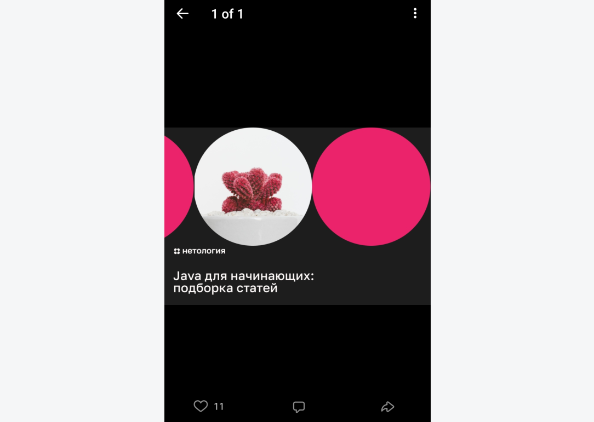

# Домашнее задание к занятию «4.1. Загрузка и отображение изображений»

Выполненное задание прикрепите ссылкой на ваши GitHub-проекты в личном кабинете студента на сайте [netology.ru](https://netology.ru).

**Важно**: ознакомьтесь со ссылками на главной странице [репозитория с домашними заданиями](../README.md).

**Важно**: если у вас что-то не получилось, оформите Issue. [Шаблон для оформления](../report-requirements.md).

## Как сдавать задачи

1. Откройте ваш проект Android-приложения с предыдущего ДЗ (можете брать код из лекции).
1. Сделайте необходимые коммиты.
1. Сделайте пуш. Удостоверьтесь, что ваш код появился на GitHub.
1. Ссылку на ваш проект прикрепите в личном кабинете на сайте [netology.ru](https://netology.ru).
1. Выполните все задачи, чтобы получить зачёт по теме.

## Задача №1. Photo

### Описание

У вас есть пример загрузки изображений, теперь мы реализуем их отображение. Давайте посмотрим, как это сделано в приложении ВКонтакте.

Если в посте есть картинка, то она отображается внутри этого поста:

Если кликнуть на картинку, она открывается на весь экран:

Ваша задача — реализовать подобное поведение через фрагменты, когда при клике на картинку открывается новый фрагмент, на котором изображение выводится на весь экран.

При оформлении AppBar достаточно, чтобы фон был чёрный и картинка отображалась по центру.

**Важно**: URL картинки будет: API_URL/media/<id>. Т. е. если с сервера вам вернулся: d7dff806-4456-4e35-a6a1-9f2278c5d639.png, то полный URL будет: http://10.0.2.2:9999/media/d7dff806-4456-4e35-a6a1-9f2278c5d639.png.

### Результат

Опубликуйте изменения в виде Pull Request в вашем проекте на GitHub.

Результат пришлите ссылкой на PR GitHub-проект в личном кабинете студента на сайте [netology.ru](https://netology.ru).
